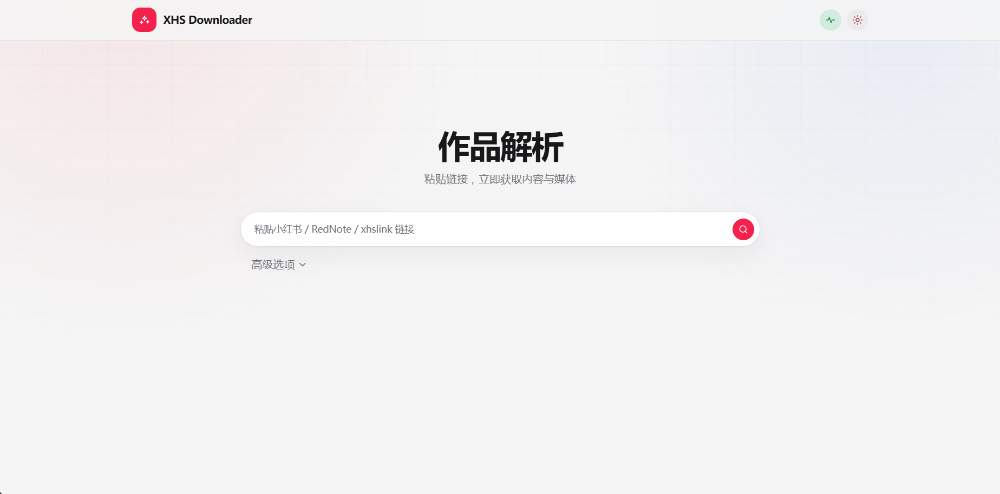

<div align="center">
<br>
<h1>XHS-Downloader</h1>
<p>简体中文 | <a href="README_EN.md">English</a></p>
<a href="https://trendshift.io/repositories/5435" target="_blank"></a>
<br>


<br>


</div>
<br>
<p>🔥 <b>小红书链接提取/作品采集工具</b>：提取账号发布、收藏、点赞、专辑作品链接；提取搜索结果作品链接、用户链接；采集小红书作品信息；提取小红书作品下载地址；下载小红书作品文件！</p>
<p>🔥 “小红书”、“XiaoHongShu”、“RedNote” 含义相同，本项目统称为 “小红书”</p>

## 项目说明

本项目基于 [XHS-Downloader](https://github.com/JoeanAmier/XHS-Downloader) 进行二次开发。

在保留原项目核心功能的基础上，本项目主要进行了以下调整：

- 使用 Go 重构部分 API
- 新增 Web 搜索页和管理页面

原项目版权归原作者及贡献者所有。本项目遵循原项目的开源许可证，详情请参阅
[LICENSE](./LICENSE)。

## 部署

- **启动：**

  ```bash
  npm --prefix web ci
  npm --prefix web run build
  go run ./cmd/api
  ```

- **Web 控制台：** <http://127.0.0.1:5556/>
- **Docker：**

  ```bash
  docker compose up --build -d
  ```

- **完整开发、配置与部署说明：** [docs/GO_API.md](docs/GO_API.md)

## 项目功能

部分项目功能仍在测试同步中，以下为已实现功能：

- [x] 采集小红书作品信息
- [x] 提取小红书作品下载地址
- [x] 下载小红书作品文件
- [x] 下载小红书 Live Photo 文件
- [x] 自动跳过已下载的作品文件
- [x] 作品文件完整性处理机制
- [x] 自定义图文作品文件下载格式
- [x] 持久化存储作品信息至文件
- [x] 将作品文件存储至单独文件夹
- [] 后台监听剪贴板并下载作品
- [x] 记录已下载的作品 ID
- [] 支持通过命令行下载作品文件
- [] 支持从浏览器读取 Cookie
- [] 支持自定义文件名称格式
- [x] 支持 API 调用
- [] 支持 MCP 调用
- [x] 支持文件断点续传下载
- [x] 智能识别作品文件类型
- [] 支持设置作者备注
- [x] 自动更新作者昵称

## Web 端 (开发中)




## 支持链接

- `https://www.xiaohongshu.com/explore/作品ID?xsec_token=XXX`
- `https://www.xiaohongshu.com/discovery/item/作品ID?xsec_token=XXX`
- `https://www.xiaohongshu.com/user/profile/作者ID/作品ID?xsec_token=XXX`
- `https://xhslink.com/分享码`
- `https://xhslink.cn/分享码`

## 获取Cookie

1. 打开浏览器（可选择无痕模式），访问 <https://www.xiaohongshu.com/explore>
2. 登录小红书账号（可跳过）
3. 按下 `F12` 打开开发者工具
4. 选择 **网络（Network）** 选项卡
5. 勾选 **保留日志（Preserve log）**
6. 在 **过滤（Filter）** 输入框中输入 `cookie-name:web_session`
7. 选择 **Fetch/XHR** 筛选器
8. 点击小红书页面中的任意作品
9. 在 **网络** 选项卡中选择任意数据包（如果没有数据包，请重复步骤 8）
10. 找到请求标头中的 `Cookie`，全选并复制，然后写入程序或配置文件


# 声明 

以下是原作者的项目赞助与贡献指南。

# 💝 项目赞助

## Bloome

<p><a href="https://bloome.im/login?ref=KUyJQU6F"></a></p>
<p>不想在本地折腾环境？可以把 XHS-Downloader 作为一个 Agent 接入 <a href="https://bloome.im/login?ref=KUyJQU6F">Bloome</a>：零配置，一键在云端运行，浏览器和手机都能用，还能把配置好的 Agent 直接分享给他人，无需各自部署！</p>
<p>立即体验：<a href="https://bloome.im/login?ref=KUyJQU6F">https://bloome.im/login?ref=KUyJQU6F</a></p>

***

## DartNode

[](https://dartnode.com "Powered by DartNode - Free VPS for Open Source")

***

## ZMTO

<p><a href="https://www.zmto.com/"></a></p>
<p><a href="https://www.zmto.com/">ZMTO</a>：一家专业的云基础设施提供商，以可靠的尖端技术与专业支持，提供高效的解决方案，并为符合条件的开源项目提供企业级VPS基础设施，支持开源生态系统的可持续发展与创新。</p>
<h1>♥️ 支持项目</h1>
<p>如果 <b>XHS-Downloader</b> 对您有帮助，请考虑为它点个 <b>Star</b> ⭐，感谢您的支持！</p>
<table>
<thead>
<tr>
<th align="center">微信(WeChat)</th>
<th align="center">支付宝(Alipay)</th>
</tr>
</thead>
<tbody><tr>
<td align="center"></td>
<td align="center"></td>
</tr>
</tbody>
</table>
<p>如果您愿意，可以考虑提供资助为 <b>XHS-Downloader</b> 提供额外的支持！</p>
<h1>🌟 贡献指南</h1>
<p><strong>欢迎对本项目做出贡献！为了保持代码库的整洁、高效和易于维护，请仔细阅读以下指南，以确保您的贡献能够顺利被接受和整合。</strong></p>
<ul>
<li>在开始开发前，请从 <code>develop</code> 分支拉取最新的代码，以此为基础进行修改；这有助于避免合并冲突并保证您的改动基于最新的项目状态。</li>
<li>如果您的更改涉及多个不相关的功能或问题，请将它们分成多个独立的提交或拉取请求。</li>
<li>每个拉取请求应尽可能专注于单一功能或修复，以便于代码审查和测试。</li>
<li>遵循现有的代码风格；请确保您的代码与项目中已有的代码风格保持一致；建议使用 Ruff 工具保持代码格式规范。</li>
<li>编写可读性强的代码；添加适当的注释帮助他人理解您的意图。</li>
<li>每个提交都应该包含一个清晰、简洁的提交信息，以描述所做的更改。提交信息应遵循以下格式：<code>&lt;类型&gt;: &lt;简短描述&gt;</code></li>
<li>当您准备提交拉取请求时，请优先将它们提交到 <code>develop</code> 分支；这是为了给维护者一个缓冲区，在最终合并到 <code>master</code>
分支之前进行额外的测试和审查。</li>
<li>建议在开发前或遇到疑问时与作者沟通，确保开发方向一致，避免重复劳动或无效提交。</li>
</ul>
<p><strong>参考资料：</strong></p>
<ul>
<li><a href="https://www.contributor-covenant.org/zh-cn/version/2/1/code_of_conduct/">贡献者公约</a></li>
<li><a href="https://opensource.guide/zh-hans/how-to-contribute/">如何为开源做贡献</a></li>
</ul>
<h1>✉️ 联系作者</h1>
<ul>
<li>作者邮箱：yonglelolu@foxmail.com</li>
<li>作者微信: Downloader_Tools</li>
<li>微信公众号: Downloader Tools</li>
<li><b>Discord 社区</b>: <a href="https://discord.com/invite/ZYtmgKud9Y">点击加入社区</a></li>
<li>QQ 群聊: <a href="https://github.com/JoeanAmier/XHS-Downloader/blob/master/static/QQ%E7%BE%A4%E8%81%8A%E4%BA%8C%E7%BB%B4%E7%A0%81.png">扫码加入群聊</a></li>
</ul>
<p><b>说明：</b>QQ 群聊仅限于讨论项目使用问题，严禁发布任何广告，严禁讨论任何账号交易、账号流量、流量变现、灰色产业等相关的内容！</p>
<p>✨ <b>作者的其他开源项目：</b></p>
<ul>
<li><b>DouK-Downloader（抖音、TikTok）</b>：<a href="https://github.com/JoeanAmier/TikTokDownloader">https://github.com/JoeanAmier/TikTokDownloader</a></li>
<li><b>KS-Downloader（快手、KuaiShou）</b>：<a href="https://github.com/JoeanAmier/KS-Downloader">https://github.com/JoeanAmier/KS-Downloader</a></li>
</ul>
<h1>⭐ Star 趋势</h1>
<p>

</p>
<h1>⚠️ 免责声明</h1>
<ol>
<li>使用者对本项目的使用由使用者自行决定，并自行承担风险。作者对使用者使用本项目所产生的任何损失、责任、或风险概不负责。</li>
<li>本项目的作者提供的代码和功能是基于现有知识和技术的开发成果。作者按现有技术水平努力确保代码的正确性和安全性，但不保证代码完全没有错误或缺陷。</li>
<li>本项目依赖的所有第三方库、插件或服务各自遵循其原始开源或商业许可，使用者需自行查阅并遵守相应协议，作者不对第三方组件的稳定性、安全性及合规性承担任何责任。</li>
<li>使用者在使用本项目时必须严格遵守 <a href="https://github.com/JoeanAmier/XHS-Downloader/blob/master/LICENSE">GNU
    General Public License v3.0</a> 的要求，并在适当的地方注明使用了 <a
        href="https://github.com/JoeanAmier/XHS-Downloader/blob/master/LICENSE">GNU General Public License
    v3.0</a> 的代码。
</li>
<li>使用者在使用本项目的代码和功能时，必须自行研究相关法律法规，并确保其使用行为合法合规。任何因违反法律法规而导致的法律责任和风险，均由使用者自行承担。</li>
<li>使用者不得使用本工具从事任何侵犯知识产权的行为，包括但不限于未经授权下载、传播受版权保护的内容，开发者不参与、不支持、不认可任何非法内容的获取或分发。</li>
<li>本项目不对使用者涉及的数据收集、存储、传输等处理活动的合规性承担责任。使用者应自行遵守相关法律法规，确保处理行为合法正当；因违规操作导致的法律责任由使用者自行承担。</li>
<li>使用者在任何情况下均不得将本项目的作者、贡献者或其他相关方与使用者的使用行为联系起来，或要求其对使用者使用本项目所产生的任何损失或损害负责。</li>
<li>本项目的作者不会提供 XHS-Downloader 项目的付费版本，也不会提供与 XHS-Downloader 项目相关的任何商业服务。</li>
<li>基于本项目进行的任何二次开发、修改或编译的程序与原创作者无关，原创作者不承担与二次开发行为或其结果相关的任何责任，使用者应自行对因二次开发可能带来的各种情况负全部责任。</li>
<li>本项目不授予使用者任何专利许可；若使用本项目导致专利纠纷或侵权，使用者自行承担全部风险和责任。未经作者或权利人书面授权，不得使用本项目进行任何商业宣传、推广或再授权。</li>
<li>作者保留随时终止向任何违反本声明的使用者提供服务的权利，并可能要求其销毁已获取的代码及衍生作品。</li>
<li>作者保留在不另行通知的情况下更新本声明的权利，使用者持续使用即视为接受修订后的条款。</li>
</ol>
<b>在使用本项目的代码和功能之前，请您认真考虑并接受以上免责声明。如果您对上述声明有任何疑问或不同意，请不要使用本项目的代码和功能。如果您使用了本项目的代码和功能，则视为您已完全理解并接受上述免责声明，并自愿承担使用本项目的一切风险和后果。</b>

# 💡 项目参考

* https://github.com/encode/httpx/
* https://github.com/tiangolo/fastapi
* https://github.com/textualize/textual/
* https://github.com/pyinstaller/pyinstaller
* https://github.com/zbowling/beartype-pyinstaller-repro
* https://github.com/jlowin/fastmcp
* https://github.com/omnilib/aiosqlite
* https://github.com/carpedm20/emoji/
* https://github.com/asweigart/pyperclip
* https://github.com/lxml/lxml
* https://github.com/yaml/pyyaml
* https://github.com/pallets/click/
* https://github.com/encode/uvicorn
* https://github.com/Tinche/aiofiles
